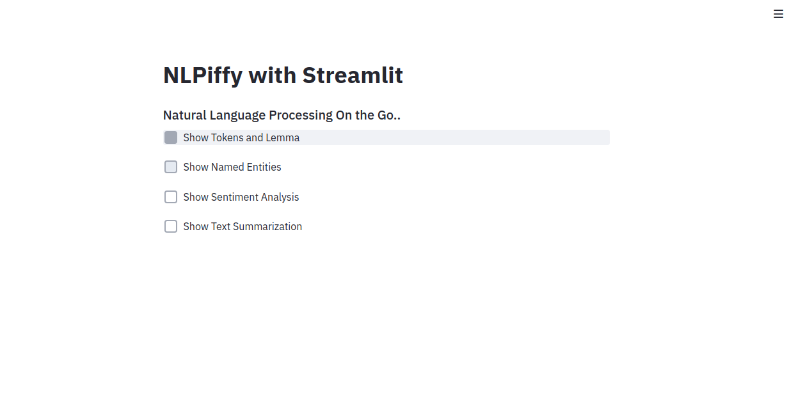
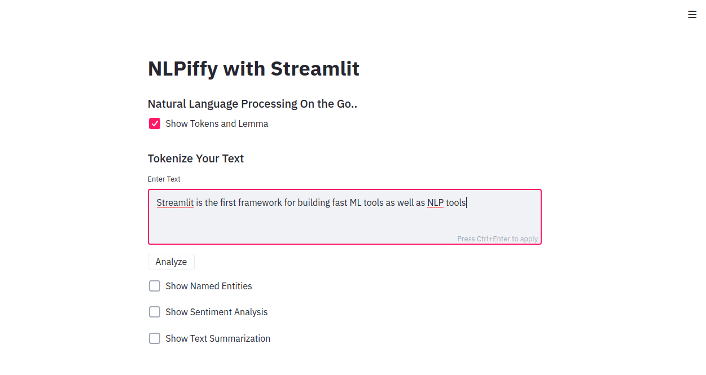
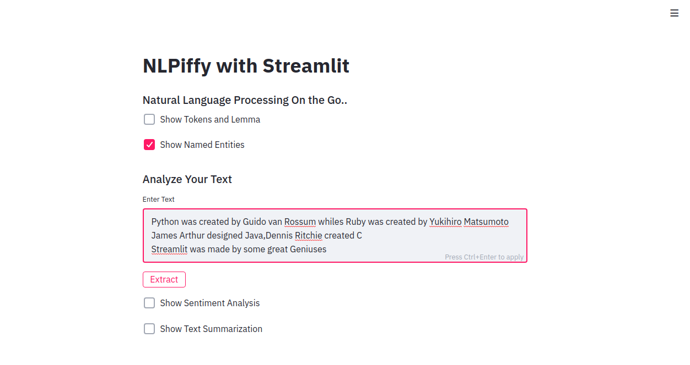
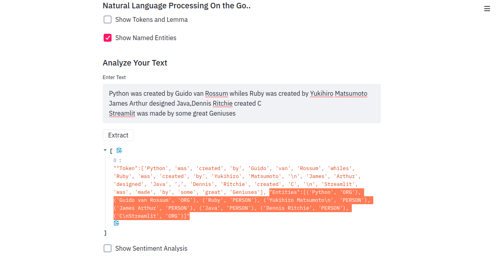
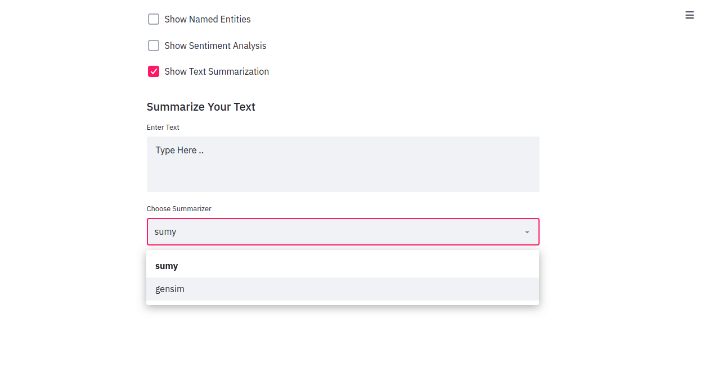

## NLP Based App with Streamlit
+ (NLPiffy) -Natural Language Processing on the Go

#### Description
+ A NLP app built with streamlit framework using SpaCy for Named Entity Extraction(NER) and tokenization, TextBlob for sentiment analysis and Gensim and Sumy for text summarization

#### To Run the App
```bash
streamlit run app.py
```

```python -m spacy download en_core_web_sm
import spacy
nlp = spacy.load("en_core_web_sm")
```

#### NLP App



#### Tokenization


#### Entity Extraction with Spacy


#### Entity Extraction with Spacy


#### Text Summarization with Sumy/Gensim



